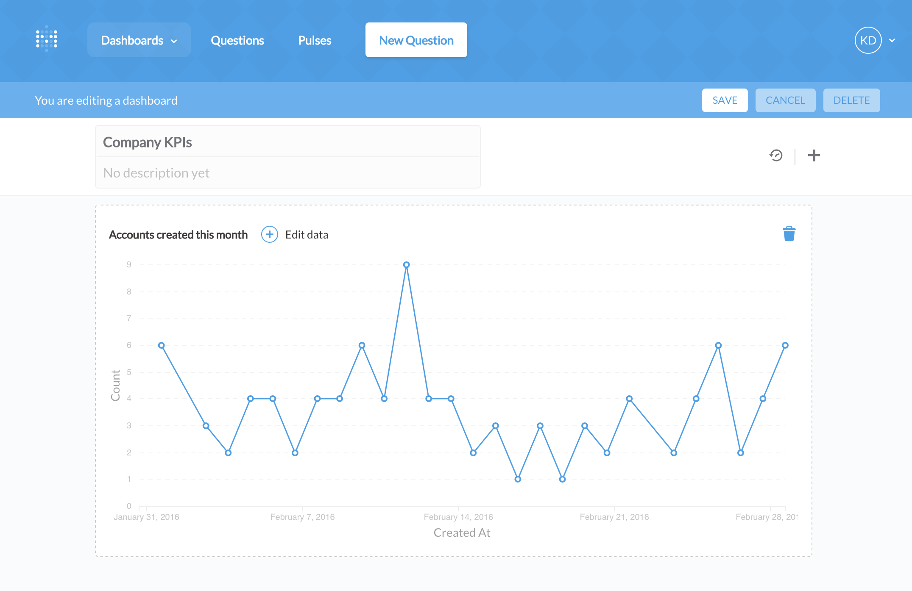
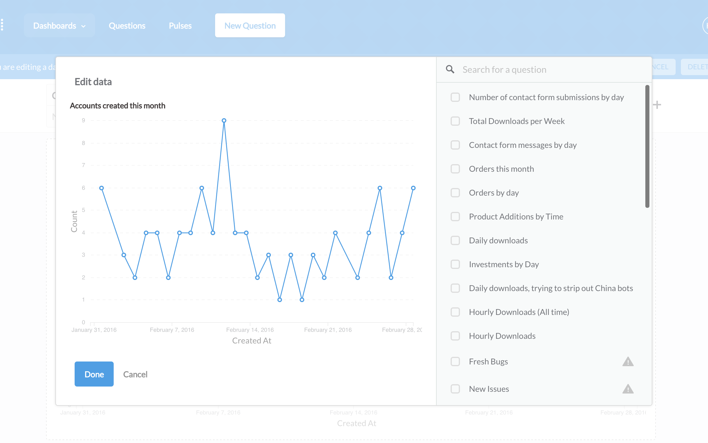
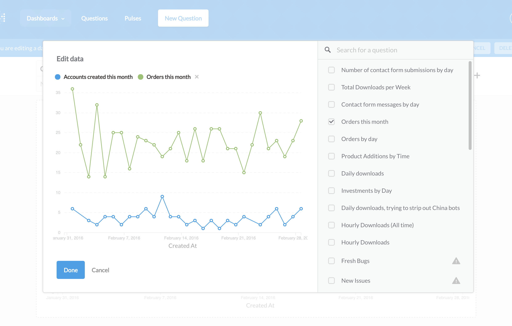
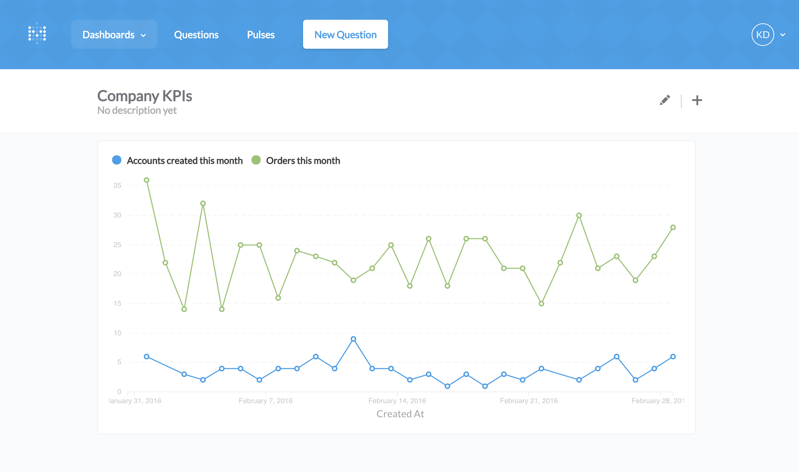
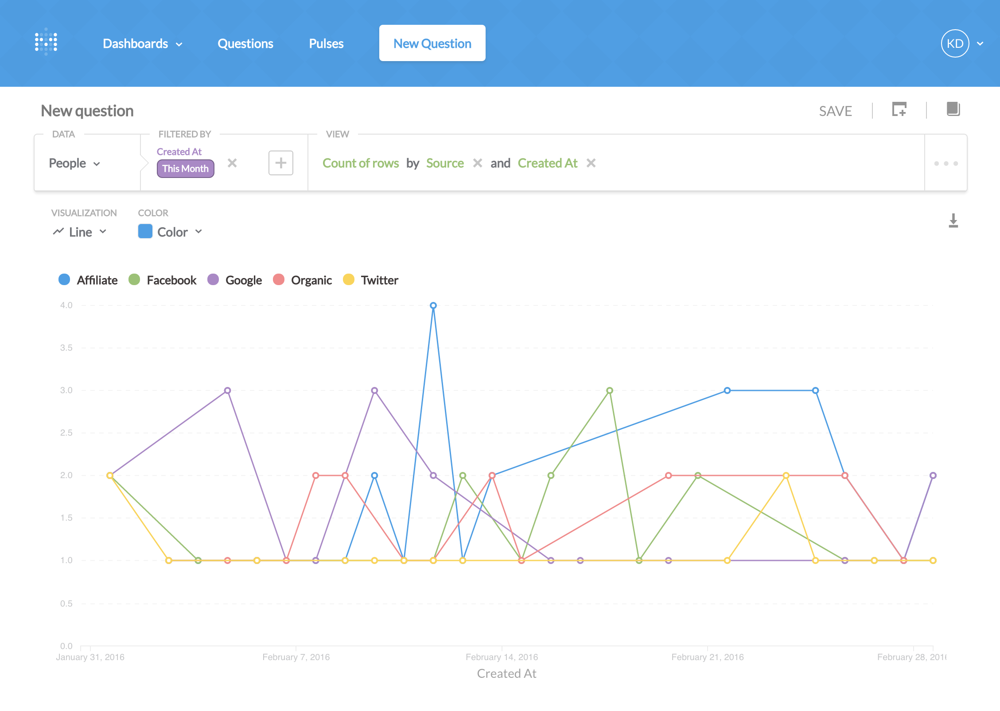

# Charts with multiple series

Data in isolation is rarely all that useful. One of the best ways to add context and clarity when communicating with data is to show data side-by-side with other data. Here are just a few  examples of data that is better together than apart.

- Your company’s revenue vs. its costs over time.
- Average order price this month and user signups for that month.
- New users per day vs. returning users per day.
- Orders per day from a few different product lines.

## In Metabase there are two main ways to get data side-by-side.

1. Combining two existing saved questions that share a common dimension (like time) on a dashboard

e.g. Let me see revenue over time and cost over time together.

2. Asking a question that involves multiple dimensions in the query builder (or in SQL if you’re fancy).

e.g. The count of users by region over time.

## Combining two existing saved questions
If you already have two or more saved questions you’d like to compare, and they share a dimension, they can be combined on any dashboard. Here’s how:

1. Add a question with a dimension like time or a category to a dashboard. In practice, these will usually be line charts or bar charts.

2. While in edit mode on the dashboard, hovering on the card will show a “Edit data” button. Click this button to start adding series that you want to compare to the first series..

3. In the Edit Data modal you’ll see the original question, and on the right you’ll see a list of compatible questions you can choose from. Check the box next to any questions you’d like to see side-by-side with the original, and Metabase will add it to the same chart.

The X and Y axis will automagically update if necessary and Metabase will create a legend using the existing card titles to help you understand which question maps to which series on the chart. Repeat this process as many times as you need.

To remove a series either uncheck the box, or click the x next to the title in the legend above the chart.

Once you have your chart looking how you’d like, hit done and your changes will be shown on the card in the dashboard. Depending on how dense your data is, at this point you might want to consider enlarging your chart to make sure the data is legible.

### A quick note about SQL based questions.
Metabase has less information about SQL based questions, so we cannot guarantee if they can be added reliably. You'll see a little warning sign next to SQL questions to indicate this and when you try adding them just be aware it may not work.

##  Combining scalars
If you need to compare flat numbers and get a sense of how they differ, Metabase also lets you turn multiple scalars into a bar chart. To do this, follow the same process outlined above. While editing a dashboard, click “edit data” on the scalar of your choice and then select the other scalars you’d like to see represented on the bar chart.

At Metabase, we use this to create simple funnel visualizations.

## Creating a multi-series visualization in the query builder.
If you’re creating a new question in the query builder, you can also view the result as a multi-series visualization. To do this you’ll need to add two dimensions to your question and use an aggregation that isn’t just “raw data.”

As an example, we might want to see which service is referring the most people to our product this month.

(In the sample dataset that ships with Metabase this would involve using the Source and Created At dimensions of the “People” table.)

To do this we’d select “Count of rows” and then add “Source and “Created At.” Then, we’d add a filter to limit the results to just this month. You can learn more about how to work with the query builder in the “Asking questions” section of the user guide.

If we switch the resulting table to a line or bar chart we can now see a multi-series visualization of how each referrer has performed for us this month.

It’s worth noting that at this time you won’t be able to add another saved question to multi-series visualizations made in this fashion.  Metabase can only visualize up to 10 values of a dimension at once, so you may need to filter the values if you're selecting a field that contains a lot of values like "State."

## Other multiple series tips
- When displaying multiple series it’s important to keep legibility in mind. Combining many series can sometimes decrease the communication value of the data.

## To recap:

- Existing saved questions can be combined and displayed on dashboards when editing the dashboard.
- Scalars can be combined to create bar charts and simple funnels
- You can produce a multi-series visualization in the query builder by adding two dimensions to your query.

Go forth and start letting your data get to know each other.

---
## That’s it!
If you still have questions, or want to share Metabase tips and tricks, head over to our [discussion board](http://discourse.metabase.com/). See you there!
